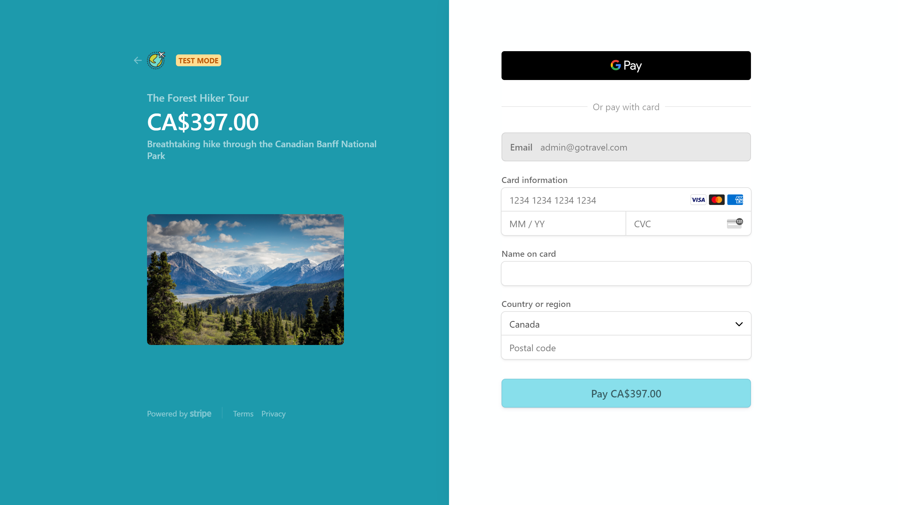

# GoTravel - a MERN Stack Travel Agency Website

### Backend 

Backend was built based on a tutorial from https://www.udemy.com/course/nodejs-express-mongodb-bootcamp/

### Fronted built with Create-React-App

Complete with
  * User authentication & authorization
  * RESTful API calls with Axios NPM
  * State management with Redux
  * Forms created with Redux-Form
  * Routes handled with React-Router-DOM
  * Payment handled with Stripe
  * Use of both class-based and fuction-based components (will upgrade to all function-based in the future)
  * LOTS OF BUGS!!!

### Sneak peak

